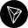

# Coins

| Cryptocurrencies |
| :--- |
|  [Bitcoin](bitcoin/overview-btc.md) |
|  [Ethereum](ethereum/overview-eth.md) |
|  [Bitcoin Cash](bitcoin-cash/overview-bch.md) |
|  [Binance Coin](binance-coin/overview-bnb.md) |
|  [Tezos](tezos/overview-xtz.md) |
|  [Litecoin](litecoin/overview-ltc.md) |
|  [EOS](eos/overview-eos.md) |
|  [Monero](monero/overview-xmr.md) |
|  [Stellar](stellar/overview-xlm.md) |
|  [Cardano](cardano/overview-ada.md) |
|  [NEO](neo/overview-neo.md) |
|  [Cosmos](cosmos/overview-atom.md) |
|  [HEX](hex/overview-hex.md) |
|  [Vechain](vechain/overview-vet.md) |
|  [TRON](tron/overview-trx.md) |
|  [ICON](icon/overview-icx.md) |
|  [Decred](decred/overview-dcr.md) |
|  [Ontology](ontology/overview-ont.md) |
|  [Komodo](komodo/overview-kmd.md) |
|  [THETA](theta/overview-theta.md) |
|  [Zcoin](zcoin/overview-xzc.md) |
|  [Waves](waves/overview-waves.md) |
|  [Grin](grin/overview-grin.md) |
|  [Beam](beam/overview-beam.md) |
|  [LivePeer](livepeer/overview-lpt.md) |
|  [Edgeware](edgeware/overview-edg.md) |
|  [Synthetix](synthetix/overview-snx.md) |
|  [Telos](telos/overview-tlos.md) |

