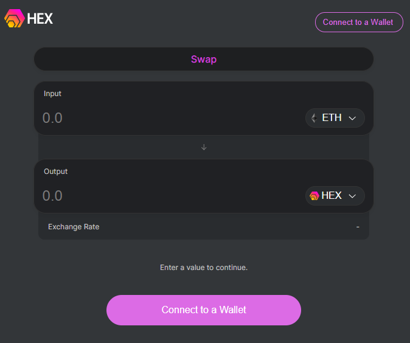
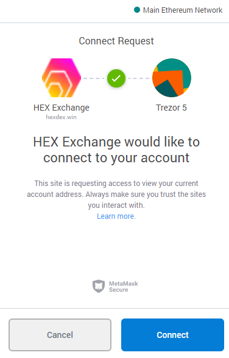

# Guide: How to buy HEX

## 👜 1\) Install MetaMask

Refer to the following link if you need to setup MetaMask.



## 💰 2\) Fund your account with Ether

By this point, you'll need some ETH in your MetaMask wallet. Refer

## 💱 3\) Swap Ether for Hex at Uniswap Exchange

1. **Open** in your browser, [Hexdex.win](https://hexdex.win/swap)

2. **Click** "Connect a Wallet" button

3. **Click** "MetaMask"

4. **Type** your MetaMask password if prompted

5. **Click "**Connect" to allow the Hex Exchange to connect to MetaMask

6. Time to decide how many HEX you want or how much ETH you want to spend.

* **Type** how many **Ethers** you want to convert into HEX into the "Input" box
* or **type** how many **HEX** you want in the "Output" box


Notice the opposite asset is automatically filled with an estimated amount.


7. **Click** "Swap" and then **confirm** the transaction in MetaMask.


Congratulations. It's that easy!


